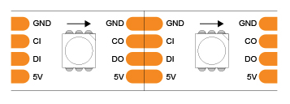
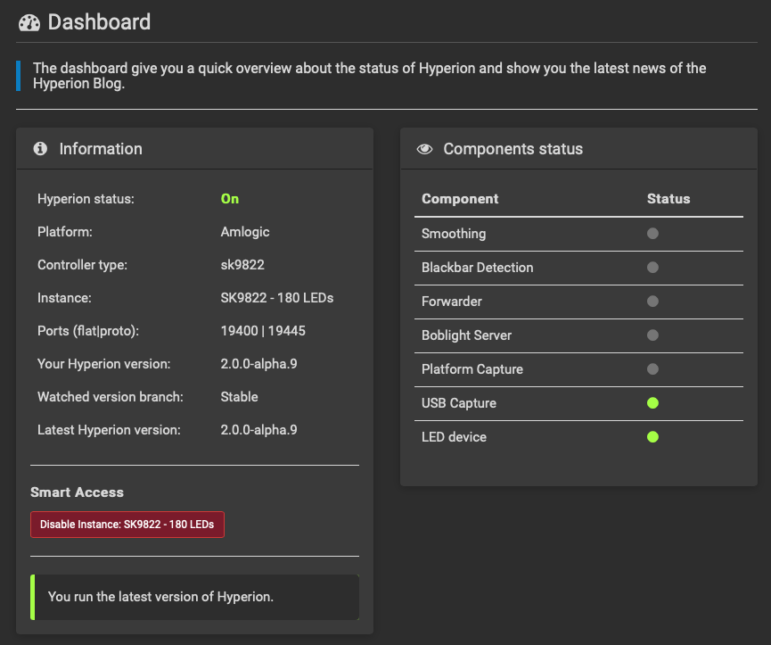

# Overview

Goal of this project is to act as a storage repository for various Raspberry Pi projects. At the moment, I'm running a [k3s](https://k3s.io) [kubernetes cluster](https://kubernetes.io) on Ubuntu 20.04.2 on a single Raspberry Pi 4.

# Initial setup

## Prepare the SD card
1. Download the [64-bit Ubuntu 20.04 ARM image for Raspberry Pi](https://ubuntu.com/download/raspberry-pi)
2. Flash the image using `dd` or [BalenaEtcher](https://www.balena.io/etcher/)
3. Safely eject the SD-card, insert it into your network connected Pi (recommend ethernet), and turn it on

## Configure your pi
1. Find your pi local IP address (or just use your router GUI)
```
# Grab your pi IP address
IP_ADDRESS=$(arp -a | awk '/ubuntu/ {print $2}' | tr -d '()')
```
2. ssh into your pi and change the default password
```
ssh ubuntu@${IP_ADDRESS}
```
3. Copy your ssh key to your pi
```
ssh-copy-id ubuntu@${IP_ADDRESS}
```
4. Append the following text to the end of the existing first line in `/boot/firmware/cmdline.txt`
```
cgroup_enable=cpuset cgroup_memory=1 cgroup_enable=memory
```
This allows for limits to be enforced for containers (important)

5. Install the following hotfix to ensure Bluetooth works (hotfix for pi 4)
```
sudo apt update
sudo apt install pi-bluetooth
```
6. Reboot your pi for the changes to take effect:
```
sudo reboot
```

## Install k3s
1. In your workstation shell, install k3sup
```
curl -sLS https://get.k3sup.dev | sudo sh
```
2. Install k3s on your pi
```
k3sup install --ip ${IP_ADDRESS} --user ubuntu --k3s-channel stable
```

## Configure your workstation
1. Install helm, kubernetes-cli, kubectx, and k9s (if not already installed)
```
brew install helm kubernetes-cli kubectx k9s
```
2. Save the rancher kubeconfig to your local workstation, but replace localhost with the pi private IP address, and the default name values with your own name (to prevent collisions):
```
PI_NAME=homepi4
ssh ubuntu@${IP_ADDRESS} "sudo cat /etc/rancher/k3s/k3s.yaml" | sed -e "s/127.0.0.1/${IP_ADDRESS}/; s/: default/: ${PI_NAME}/" > ~/.kube/k3s-config
```
3. Back up and replace your existing kubeconfig with the merged kubeconfig with the k3s cluster config
```
cp ~/.kube/config ~/.kube/config.bak && KUBECONFIG=~/.kube/config:~/.kube/k3s-config kubectl config view --flatten > /tmp/config && mv /tmp/config ~/.kube/config
```
4. Switch to your pi k3s context
```
kubectl config use-context ${PI_NAME}
```
5. Confirm you can see pods running with no errors:
```
kubectl get po --all-namespaces
```
6. (Optional) Delete the kubeconfig backup:
```
rm ~/.kube/k3s-config
```

## References

* [k3s on 64-bit Ubuntu for Raspberry Pi blog post](https://blog.alexellis.io/falco-at-the-edge-arm64/)

# Homebridge

## Overview

Homebridge is a useful tool for converting existing smart devices into homekit compatible ones. You can learn more [here](https://homebridge.io). Running it in a container helps isolate it from other applications and their dependences running on your pi.

## Bluetooth

By default, this container runs with access to bluetooth as some of the homebridge plugins I use require it. Prior to installing homebridge, be sure disable the bluetooth service on your pi host so it does not conflict with the one running inside the container:
```
ssh ubuntu@${IP_ADDRESS} "sudo systemctl stop bluetooth && sudo systemctl disable bluetooth"
```

## The helm way

[Helm](https://helm.sh) has some neat templating options that let you customize a deployment without having to edit the podspecs directly. First, edit `homebridge/values.yaml` to your liking. In particular, be sure to set these values:
```
feature:
  bluetooth: true
  ingress: true
  webhook: true
```
If you don't know what any of the above options mean, you probably don't need them. Set those values to `false`.

Once you're happy with `values.yaml`, install homebridge with:
```
NAME=homebridge
NAMESPACE=homebridge
kubectl create ns ${NAMESPACE}
helm install -n ${NAMESPACE} -f homebridge/values.yaml ${NAME} ./homebridge
```

## The old fashioned kubectl way

Instead of using helm and editing `values.yaml`, open `homebridge.yml` and edit the podspec directly.

If you wish to run without Bluetooth and you didn't install via helm, make the following modifications to homebridge.yaml:
  * Remove the `PACKAGES` env var from the env array
  * Remove the entire `bluetooth` element/object from the `volumeMounts` array
  * (Optional) For improved security, set the two ID values in the env vars section to 1000 instead of 0 so you don't run homebridge as root.
  * (Optional) Remove the entire homebridge ConfigMap yaml document as it is unnecessary, although has no material impact

Once you are finished making your modifications (if any) apply the homebridge yaml file:
```
kubectl apply -f homebridge.yml
```

## Checking the status of homebridge

You should be able to open the following URL:
```
open http://${IP_ADDRESS}:8581
```
And log in with the default username and password (admin/admin). Be sure to change this after you log in!

Any installed plugins and settings should be persisted to the /homebridge directory stored on the homebridge PVC.

## References
* [Docker Homebridge](https://github.com/oznu/docker-homebridge)
* [Using Bluetooth in a Docker container](https://stackoverflow.com/a/64126744)
* [Switchbot BLE homebridge plugin](https://github.com/OpenWonderLabs/homebridge-switchbot-ble)


# Hyperion

## Overview

Hyperion enables granularly management LED lighting strips and is often used to power ambient/bias lighting behind TVs. In particular, hyperion has a powerful configurator tool that lets you match video capture input to LED lighting output. You can learn more [here](https://github.com/hyperion-project/hyperion.ng).

## Parts

Besides the Raspberry Pi 4 we're already using, the most important parts are:

**USB video capture device**
* If you have a 4k TV, I recommend getting one with 4k 60Hz passthrough (e.g. HDMI 2.0/2.1)
* I'd recommend at least 720p/30Hz video capture (mine goes up to 1080p/60Hz)
* [USB video capture device I'm using](https://www.amazon.com/gp/product/B08LV4LRDG)

**LED lighting strip**
* I highly recommend APA102 or SK9822 LED strips for best color/brightness, and ease of setup (slightly pricier though)
* Your total strip length will be the perimeter of the back of your TV (you can also opt for 3 sides of the TV)
* I'm using 60 LEDs per meter, but 30 LEDs is probably fine too. 144 LEDs/m is both expensive and overkill (imo)
* [5m 60/m LED strip I'm using](https://www.amazon.com/gp/product/B07BPYFB28)

**LED power supply**
* For APA102/SK9822 LEDs, it needs to be a 5V PSU and it's about 67 mA / 0.33 watts per LED
* For example, I plan on using approximately 3m worth of 60/m LEDs, so 180 LEDs = 60 watt PSU minimum.
* [5V 75W DC PSU I'm using](https://www.amazon.com/gp/product/B01LXN7MN3)

For testing the quality of the LED power supply, you'll probably want a multimeter if you don't have one already. I use [this multimeter](https://www.amazon.com/gp/product/B07SHLS639). Also, if you have multiple input devices, it may be worth getting an HDMI input switcher so you can run all your devices through your ambilight video capture setup. I use [this switcher](https://www.amazon.com/gp/product/B089Q8F9RZ). And, if you don't already have breadboard wires, I picked up [these wires](https://www.amazon.com/gp/product/B072L1XMJR) since I'm a noob at soldering.

You can also source your parts from overseas for probably quite a bit cheaper, but you may be playing QA roulette over the course of a couple months.
## Wiring

Before you start wiring up anything, first use your multimeter to test the DC voltage from your power supply. It should read between 5 and 5.5 volts. Mine read 5.2.

The best wiring diagram I found was from [this post](https://pimylifeup.com/raspberry-pi-led-strip-apa102/), although the green and yellow wires are actually switched for my particular LED strip (slightly confusing). Diagram below:


Wiring up the LED strip to the power supply and Raspberry Pi doesn't take long, provided you know what you're doing. I made the mistake of wiring up the output power/data wires instead of the input ones and it took me a couple of hours to figure that out. To avoid this, please ensure that you are wiring the input data and power wires using the 4 pin connector that goes into the LEFT side of the LED strip diagrammed below, not the right:



For me, the connector came from the center of the LED spool, which I thought was strange, but it worked. Here are what the 4 input pins on the LED strip do:
* 5V/VCC - Input voltage -> wire it from the power supply and not the Pi since the Pi doesn't supply enough power
* CI/CKI - Clock input channel -> wire it to the SCLK GPIO pin (GPIO pin 14/physical pin 23)
* DI/SDI - SPI data input channel -> wire it to the MOSI GPIO pin (GPIO pin 12/physical pin 19)
* GND - Electrical ground -> wire it to the ground port on your DC power supply

You'll also want to wire the Pi's ground port (physical pin 6) to the DC power supply as well (they can share the port). I'd highly recommend checking out the GPIO pin diagrams on [this page](https://pi4j.com/1.2/pins/model-3b-rev1.html)

## Setting up Hyperion

First, plug in your HDMI input and output sources into your USB video capture device. I used computer and monitor since it's convenient. Set this up first before plugging in the USB device into the Raspberry Pi.

Next, we need to figure out the device address of the USB capture device. The easy, but hacky way to do so is to take diff of all `/dev/` devices before and after you plug in the USB capture device. Take care to plug in the USB cable into the correct set of USB ports (USB 3.0 vs 2.0).
```
ssh ubuntu@${IP_ADDRESS}
ls -1 /dev > ~/before.txt
```
Plug in your USB video capture device and then run:
```
ls -1 /dev > ~/after.txt
diff ~/before.txt ~/after.txt
```
Sample output:
```
18a19
> hidraw0
285a287
> media2
896a899
> usb
927a931,932
> video0
> video1
```
If you have different video devices listed, you'll need to change the `path` attribute under the corresponding `hostPath` volume in `hyperion.yml` to your video device output (e.g. `/dev/video0` => `/dev/videoX`)

Once your video device is set (if needed), apply the yaml file.
```
kubectl apply -f hyperion.yml
```
After the pod is up and running and the loadbalancer has gotten a proper IP, you should be able to hit the Pi IP address in a web browser on port 8090:
```
open http://${IP_ADDRESS}:8090
```
## Configuring hyperion

There's a ton of configuration options here, so you'll need to do a few things:

Set the default admin password to something of your choosing.

Under `Configuration` -> `LED Hardware`:
* Set `Controller type `to sk9822 (or apa102)
* Click the `Save settings` button
* Click on the `LED Layout` tab at the top and set up your LED layout. I chose 50/50 top/bottom and 40/40 left/right (180 total), which was well within the rating for my power supply.
* Click the `Save settings` button


Under `Configuration` -> `Capturing Hardware`:
* Uncheck `Enable platform capture` and check `Enable USB capture`
* Further down on that page under `USB Capture`:
  * Select your `Device` (e.g. USBX.0 capture)
  * Set `Device Resolution` (e.g. 720x480)
  * Set `Frames per second` (recommend 30)
  * Click the `Save settings` button

There are many other settings you can configure, but we'll get to those later. Head over to the `Dashboard` (top left) and you should see something like the this:



## Troubleshooting

If you don't have the `LED device` indicator lit up, you may want to double check your wiring. If you want to check whether hyperion could be the issue, you can always ssh into the pi and [try a test python script instead](https://pimylifeup.com/raspberry-pi-led-strip-apa102/).

If your USB video capture device isn't lit up, it may be worth replugging the USB device and restarting the hyperion pod/container.

Assuming both of those indicator lights are on, you can preview the input video and LED lights by clicking the monitor icon in the top right. If you can see the video, your LED lights should be on now and showing the edge lighting for your current screen. Hooray!

Next, you'll want to sort out whether your RGB byte order is correct (mine wasn't). Full screen the [ambilight color test video](https://www.youtube.com/watch?v=8u4UzzJZAUg) and watch the LEDs to ensure they match the color displayed in the video. For me, red displayed blue and blue displayed red, so I had to switch the `RGB byte order` under `Configuration` -> `LED Hardware` to `BGR`. Don't forget to hit `Save settings` when you're done.

Pro-tip: If you don't want to leave the LEDs on continuously, you can always hit the enable/disable dashboard button under the `Smart Access` section.

## Wrap up

Now that you have hyperion configured, you may want to pretty up the wires and hook up any other intermediate devices, but the bulk of the configuration is done. I also spent some time experimenting with the `Image Processing` configuration to see whether I preferred things like `Smoothing` and `Blackbar detection`.

I'm also using this [hyperion homebridge module](https://www.npmjs.com/package/homebridge-hyperion-ng) to enable/disable the LEDs and even control color and brightness, which seems to work pretty well. In addition, I briefly checked out this [hyperion remote iOS app](https://hyperionremote.com), which has a few additional features beyond what the homebridge plugin offers.

## Caveats

* I have noticed that making changes to the Statefulset and even just restarting the pod sometimes causes the USB video capture device to no longer function. An additional pod restart seems to resolve this most of the time.

## References
* [Raspberry Pi APA102 LED installation guide](https://pimylifeup.com/raspberry-pi-led-strip-apa102/)
* [Pi4j GPIO pin numbering](https://pi4j.com/1.2/pins/model-3b-plus-rev1.html#)
* [Hyperion docker GitHub issues thread](https://github.com/hyperion-project/hyperion.ng/issues/764)
* [Hyperion docker image](https://hub.docker.com/r/sirfragalot/hyperion.ng)
* [Hyperion user docs](https://docs.hyperion-project.org/en/user/)
* [Ambilight color test](https://www.youtube.com/watch?v=8u4UzzJZAUg)


# Router log forwarding (syslog https proxy)

## Overview

I use LogDNA for analyzing my logs (disclaimer: I work there) and take advantage of custom parsing to generate pretty graphs and track down devices abusing DHCP negotiation (I'm looking at you Wi-Fi rower). I wrote a containerized syslog forwarding module so I can send my logs over the internet via https instead of UDP. You can view the repo [here](https://github.com/logdna/logdna-rsyslog).

## Installation

I followed the same installation instructions except that I just make the services type `LoadBalancer` instead of `ClusterIP` so I can expose them to my local network.

```
INGESTION_KEY=<your LogDNA ingestion key here>

kubectl create ns logdna-agent

kubectl create secret generic -n logdna-agent logdna-agent-key --from-literal=logdna-agent-key=${INGESTION_KEY}

kubectl apply -n logdna-agent -f https://raw.githubusercontent.com/logdna/logdna-rsyslog/master/logdna-rsyslog-config-https.yml

curl -s https://raw.githubusercontent.com/logdna/logdna-rsyslog/master/logdna-rsyslog-workload.yml | sed 's/ClusterIP/LoadBalancer/g' | kubectl apply -n logdna-agent -f -
```

# References
* [rsyslog forwarder](https://github.com/logdna/logdna-rsyslog)
* [LogDNA](https://www.logdna.com)


# Log collection via LogDNA Kubernetes agent

## Overview

For the same reasons I forward my router logs via the rsyslog proxy, I also like to forward my Kubernetes container logs to LogDNA via the LogDNA agent.

## Installation

If you haven't already installed the rsyslog forwarder, follow the steps below. Otherwise, skip to the next step.
```
INGESTION_KEY=<your LogDNA ingestion key here>

kubectl create ns logdna-agent

kubectl create secret generic -n logdna logdna-agent-key --from-literal=logdna-agent-key=${INGESTION_KEY}
```

Once the `logdna-agent` namespace and secret are created, deploy the agent and its accompanying configuration.
```
curl -s https://raw.githubusercontent.com/logdna/logdna-agent-v2/2.2.4/k8s/agent-resources.yaml | sed 's#image:.*#image: beefcheeks/logdna-agent:2.2.4#' | kubectl apply -n logdna-agent -f -
```
Note: the LogDNA agent is not supported for ARM architectures. I've manually built an ARM64-compatible docker image using [docker buildx](https://github.com/docker/buildx), but due to the lack of ARMv7 support for the RedHat Universal Basic Image used as the base for the logdna-agent, it is not easily possible to build an ARMv7 one.

# References
* [LogDNA agent](https://github.com//logdna/logdna-agent-v2)
* [Docker buildx](https://github.com/docker/buildx)
* [Docker buildx multi-architecture how-to](https://medium.com/@artur.klauser/building-multi-architecture-docker-images-with-buildx-27d80f7e2408)


# SSL hosting via LetsEncrypt

## Overview

If you ever need SSL URLs for any reason (looking at you iOS http shortcuts), cert-manager offers a kubernetes friendly way of obtaining free LetsEncrypt certificates. I use cert-manager to automatically renew SSL certificates that back my https kubernetes ingress endpoints.

## Prerequisites

You'll need edit access to the hosting domain in which you are attempting to register addresses (e.g. mydomain.com). I use AWS Route53 for hosting my domain, so the instructions below are specific to Route53.

## Installation

Given cert-manager supports arm64 out of the box, there aren't any special instructions to follow besides what is documented on [their website](https://cert-manager.io/v0.14-docs/installation/kubernetes/).

Install cert-manager using the following command
```
kubectl apply -f https://github.com/jetstack/cert-manager/releases/download/v1.2.0/cert-manager.yaml
```
Verify that all 3 cert-manager pods are running the cert-manager namespace:
```
kubectl get pod -n cert-manager
```

Now comes the fun part - configuring the certificate issuer for automatic renewal. I use AWS Route53, so I followed [this guide](https://cert-manager.io/v0.14-docs/configuration/acme/dns01/route53/). I'll detail the relevant steps below.

Create a new IAM access policy. Direct link [here](https://console.aws.amazon.com/iam/home?#/policies$new?step=edit)
```
{
  "Version": "2012-10-17",
  "Statement": [
    {
      "Effect": "Allow",
      "Action": "route53:GetChange",
      "Resource": "arn:aws:route53:::change/*"
    },
    {
      "Effect": "Allow",
      "Action": [
        "route53:ChangeResourceRecordSets",
        "route53:ListResourceRecordSets"
      ],
      "Resource": "arn:aws:route53:::hostedzone/*"
    },
    {
      "Effect": "Allow",
      "Action": "route53:ListHostedZonesByName",
      "Resource": "*"
    }
  ]
}
```

Create a user and attach the named policy to it. Be sure to allow programmatic access and copy the access and secret keys when you're done. Direct link [here](https://console.aws.amazon.com/iam/home?#/users$new?step=details)

Create a secret in the cert-manager namespace that allows access to your zone sudomain in route 53:
```
SECRET_ACCESS_KEY='<IAM user secret key>'
kubectl create secret generic -n cert-manager route53 --from-literal=secret-access-key=${SECRET_ACCESS_KEY}
```

Then, create a cluster issuer referencing that secret for the domain you wish to issue SSL certs for.
```
DNS_ZONE=<mydomain.org>
ACCESS_KEY_ID=<my access key id>

echo "apiVersion: cert-manager.io/v1
kind: ClusterIssuer
metadata:
  name: letsencrypt-prod
spec:
  acme:
    server: https://acme-v02.api.letsencrypt.org/directory
    privateKeySecretRef:
      name: letsencrypt-prod
    solvers:
    - selector:
        dnsZones:
          - ${DNS_ZONE}
      dns01:
        route53:
          region: us-west-2
          accessKeyID: ${ACCESS_KEY_ID}
          secretAccessKeySecretRef:
            name: route53
            key: secret-access-key" | kubectl apply -f -
```
Create a homebridge service for the ingress to redirect to
```
apiVersion: v1
kind: Service
metadata:
  name: homebridge
  namespace: homebridge
spec:
  ports:
    - name: http
      port: 80
      protocol: TCP
      targetPort: 8581
    - name: http-webhook
      port: 8080
      protocol: TCP
      targetPort: 51828
  selector:
    app: homebridge
```
DNS_ZONE=<example.com>
```
echo "apiVersion: networking.k8s.io/v1
kind: Ingress
metadata:
  name: homebridge
  namespace: homebridge
  annotations:
    kubernetes.io/ingress.class: traefik
    cert-manager.io/cluster-issuer: letsencrypt-prod
spec:
  tls:
  - secretName: homebridge
    hosts:
    - hb.${DNS_ZONE}
  rules:
  - host: hb.${DNS_ZONE}
    http:
      paths:
      - path: /webhook
        pathType: Prefix
        backend:
          service:
            name: homebridge
            port:
              number: 8080
      - path: /
        pathType: Prefix
        backend:
          service:
            name: homebridge
            port:
              number: 80" | kubectl apply -f -
```
## Caveats

Warning: be aware that LetsEncrypt rate limits the number of certificates you can request. Read up on rate limiting [here](https://letsencrypt.org/docs/rate-limits)

## References
* https://sysadmins.co.za/https-using-letsencrypt-and-traefik-with-k3s/
* https://www.npmjs.com/package/homebridge-http-webhooks

# Pi-hole

## Overview

[Pi-hole]() can act as a DNS server, DHCP server, ad blocker/sinkhole. It's quite handy, especially if you want to allow for valid local https webhooks for things like iOS shortcuts.

## Installation

Installing pi-hole can be tricky, especially if you're already using ingress for things like homebridge webhooks. The other gotcha is that pi-hole requires port 53 to be open on the host machine, and by default, Ubuntu runs a local DNS server on that very same port.

### Disabling DNSStubListener

To allow pihole to run on port 53, disable the system DNS server running on port 53. First, edit `/etc/systemd/resolved.conf`. I use Cloudflare DNS (`1.1.1.1`).
```
[Resolve]
DNS=1.1.1.1
DNSStubListener=no
#FallbackDNS=
#Domains=
#LLMNR=no
#MulticastDNS=no
#DNSSEC=no
#DNSOverTLS=no
#Cache=no
#DNSStubListener=yes
#ReadEtcHosts=yes
```

Symlink the DNS config
```
sudo ln -sf /run/systemd/resolve/resolv.conf /etc/resolv.conf
```

To ensure the `ubuntu` hostname continues to resolve locally, edit `/etc/hosts` and append `ubuntu` to the `127.0.0.1` entry at the top.
```
127.0.0.1 localhost ubuntu
```

Restart/reload systemd-resolved
```
sudo systemctl reload-or-restart systemd-resolved
```

## Configuring Pi-hole

If you're using ingress and certificates for pihole, you'll need to configure the VIRTUAL_HOST in the pihole deployment as well as in the ingress.
```
kubectl apply -f pihole.yml
```
```
kubectl get po -n pihole
```

## Setting a static IP

Most routers allow specifying a static IP for a given connected device. If you haven't done so already, ensure you Raspberry Pi has a statically assigned IP on your router to ensure it does not need to use DHCP to assign an IP address dynamically. Once your static IP is ready to go, it may be a good idea to disconnect your pi's ethernet cable and plug it back in to force the assigning of the static IP you chose.

If you plan on specifying pi-hole as the default DNS server for DHCP devices using your router, you'll definitely need to ensure that the system hosting pi-hole doesn't attempt to use DHCP to get its IP address. To specify a static IP in Ubuntu 20.04, edit `/etc/netplan/01-netcfg.yaml`

Mine looks something like this:
```
network:
  version: 2
  renderer: networkd
  ethernets:
    eth0:
      dhcp4: no
      addresses: [<static ip>/24]
      gateway4: <router ip>
      nameservers:
        addresses: [<external dns server ip>]
```

where anything between `<` and `>` (inclusive) is replaced with the appropriate value. the `/24` at the end of the addresses entry represents the netmask. By default, most routers use `/24` (a.k.a `255.255.255.0`), but setups may vary depending on your router configuration. I'm assuming ethernet is the interface, but if not, you'll need to use an alternative configuration where `eth0` is replaced with the appropriate interface id.

To test if these changes are valid, run:
```
sudo netplan try
```

If the configuration is accepted (e.g. doesn't complain), then you can apply the configuration with:
```
sudo netplan apply
```

## Configuring a default DHCP server

At this point, if you only want select devices on your network to use pi-hole, you can configure them individually. However, if you wish for all devices on your network to use pi-hole for DNS by default, then you'll need to set the default DHCP server to be the static IP of your Raspberry Pi. Instructions will vary, and certain routers may not allow setting this, but googling the instructions for your router will likely tell you whether its possible and how to do it.

## References
* https://www.linuxuprising.com/2020/07/ubuntu-how-to-free-up-port-53-used-by.html
* https://linuxhandbook.com/sudo-unable-resolve-host/
* https://github.com/colin-mccarthy/k3s-pi-hole
* https://www.linux.com/topic/distributions/how-use-netplan-network-configuration-tool-linux/
