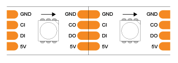
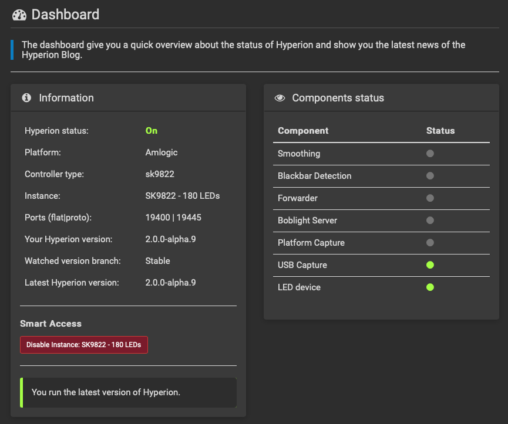

# Hyperion

## Overview

Hyperion enables granularly management LED lighting strips and is often used to power ambient/bias lighting behind TVs. In particular, hyperion has a powerful configurator tool that lets you match video capture input to LED lighting output. You can learn more [here](https://github.com/hyperion-project/hyperion.ng).

## Parts

Besides the Raspberry Pi 4 we're already using, the most important parts are:

**USB video capture device**
* If you have a 4k TV, I recommend getting one with 4k 60Hz passthrough (e.g. HDMI 2.0/2.1)
* I'd recommend at least 720p/30Hz video capture (mine goes up to 1080p/60Hz)
* [USB video capture device I'm using](https://www.amazon.com/gp/product/B08LV4LRDG)

**LED lighting strip**
* I highly recommend APA102 or SK9822 LED strips for best color/brightness, and ease of setup (slightly pricier though)
* Your total strip length will be the perimeter of the back of your TV (you can also opt for 3 sides of the TV)
* I'm using 60 LEDs per meter, but 30 LEDs is probably fine too. 144 LEDs/m is both expensive and overkill (imo)
* [5m 60/m LED strip I'm using](https://www.amazon.com/gp/product/B07BPYFB28)

**LED power supply**
* For APA102/SK9822 LEDs, it needs to be a 5V PSU and it's about 67 mA / 0.33 watts per LED
* For example, I plan on using approximately 3m worth of 60/m LEDs, so 180 LEDs = 60 watt PSU minimum.
* [5V 75W DC PSU I'm using](https://www.amazon.com/gp/product/B01LXN7MN3)

For testing the quality of the LED power supply, you'll probably want a multimeter if you don't have one already. I use [this multimeter](https://www.amazon.com/gp/product/B07SHLS639). Also, if you have multiple input devices, it may be worth getting an HDMI input switcher so you can run all your devices through your ambilight video capture setup. I use [this switcher](https://www.amazon.com/gp/product/B089Q8F9RZ). And, if you don't already have breadboard wires, I picked up [these wires](https://www.amazon.com/gp/product/B072L1XMJR) since I'm a noob at soldering.

You can also source your parts from overseas for probably quite a bit cheaper, but you may be playing QA roulette over the course of a couple months.
## Wiring

Before you start wiring up anything, first use your multimeter to test the DC voltage from your power supply. It should read between 5 and 5.5 volts. Mine read 5.2.

The best wiring diagram I found was from [this post](https://pimylifeup.com/raspberry-pi-led-strip-apa102/), although the green and yellow wires are actually switched for my particular LED strip (slightly confusing). Diagram below:


Wiring up the LED strip to the power supply and Raspberry Pi doesn't take long, provided you know what you're doing. I made the mistake of wiring up the output power/data wires instead of the input ones and it took me a couple of hours to figure that out. To avoid this, please ensure that you are wiring the input data and power wires using the 4 pin connector that goes into the LEFT side of the LED strip diagrammed below, not the right:



For me, the connector came from the center of the LED spool, which I thought was strange, but it worked. Here are what the 4 input pins on the LED strip do:
* 5V/VCC - Input voltage -> wire it from the power supply and not the Pi since the Pi doesn't supply enough power
* CI/CKI - Clock input channel -> wire it to the SCLK GPIO pin (GPIO pin 14/physical pin 23)
* DI/SDI - SPI data input channel -> wire it to the MOSI GPIO pin (GPIO pin 12/physical pin 19)
* GND - Electrical ground -> wire it to the ground port on your DC power supply

You'll also want to wire the Pi's ground port (physical pin 6) to the DC power supply as well (they can share the port). I'd highly recommend checking out the GPIO pin diagrams on [this page](https://pi4j.com/1.2/pins/model-3b-rev1.html)

## Setting up Hyperion

First, plug in your HDMI input and output sources into your USB video capture device. I used computer and monitor since it's convenient. Set this up first before plugging in the USB device into the Raspberry Pi.

Next, we need to figure out the device address of the USB capture device. The easy, but hacky way to do so is to take diff of all `/dev/` devices before and after you plug in the USB capture device. Take care to plug in the USB cable into the correct set of USB ports (USB 3.0 vs 2.0).
```
ssh pi@${IP_ADDRESS}
ls -1 /dev > ~/before.txt
```
Plug in your USB video capture device and then run:
```
ls -1 /dev > ~/after.txt
diff ~/before.txt ~/after.txt
```
Sample output:
```
18a19
> hidraw0
285a287
> media2
896a899
> usb
927a931,932
> video0
> video1
```
If you have different video devices listed, you'll need to change the `path` attribute under the corresponding `hostPath` volume in `hyperion.yml` to your video device output (e.g. `/dev/video0` => `/dev/videoX`)

Once your video device is set (if needed), apply the yaml file.
```
kubectl apply -f hyperion.yml
```
After the pod is up and running and the loadbalancer has gotten a proper IP, you should be able to hit the Pi IP address in a web browser on port 8090:
```
open http://${IP_ADDRESS}:8090
```
## Configuring hyperion

There's a ton of configuration options here, so you'll need to do a few things:

Set the default admin password to something of your choosing.

Under `Configuration` -> `LED Hardware`:
* Set `Controller type `to sk9822 (or apa102)
* Click the `Save settings` button
* Click on the `LED Layout` tab at the top and set up your LED layout. I chose 50/50 top/bottom and 40/40 left/right (180 total), which was well within the rating for my power supply.
* Click the `Save settings` button


Under `Configuration` -> `Capturing Hardware`:
* Uncheck `Enable platform capture` and check `Enable USB capture`
* Further down on that page under `USB Capture`:
  * Select your `Device` (e.g. USBX.0 capture)
  * Set `Device Resolution` (e.g. 720x480)
  * Set `Frames per second` (recommend 30)
  * Click the `Save settings` button

There are many other settings you can configure, but we'll get to those later. Head over to the `Dashboard` (top left) and you should see something like the this:



## Troubleshooting

If you don't have the `LED device` indicator lit up, you may want to double check your wiring. If you want to check whether hyperion could be the issue, you can always ssh into the pi and [try a test python script instead](https://pimylifeup.com/raspberry-pi-led-strip-apa102/).

If your USB video capture device isn't lit up, it may be worth replugging the USB device and restarting the hyperion pod/container.

Assuming both of those indicator lights are on, you can preview the input video and LED lights by clicking the monitor icon in the top right. If you can see the video, your LED lights should be on now and showing the edge lighting for your current screen. Hooray!

Next, you'll want to sort out whether your RGB byte order is correct (mine wasn't). Full screen the [ambilight color test video](https://www.youtube.com/watch?v=8u4UzzJZAUg) and watch the LEDs to ensure they match the color displayed in the video. For me, red displayed blue and blue displayed red, so I had to switch the `RGB byte order` under `Configuration` -> `LED Hardware` to `BGR`. Don't forget to hit `Save settings` when you're done.

Pro-tip: If you don't want to leave the LEDs on continuously, you can always hit the enable/disable dashboard button under the `Smart Access` section.

## Wrap up

Now that you have hyperion configured, you may want to pretty up the wires and hook up any other intermediate devices, but the bulk of the configuration is done. I also spent some time experimenting with the `Image Processing` configuration to see whether I preferred things like `Smoothing` and `Blackbar detection`.

I'm also using this [hyperion homebridge module](https://www.npmjs.com/package/homebridge-hyperion-ng) to enable/disable the LEDs and even control color and brightness, which seems to work pretty well. In addition, I briefly checked out this [hyperion remote iOS app](https://hyperionremote.com), which has a few additional features beyond what the homebridge plugin offers.

## Caveats

* I have noticed that making changes to the Statefulset and even just restarting the pod sometimes causes the USB video capture device to no longer function. An additional pod restart seems to resolve this most of the time.

## References
* [Raspberry Pi APA102 LED installation guide](https://pimylifeup.com/raspberry-pi-led-strip-apa102/)
* [Pi4j GPIO pin numbering](https://pi4j.com/1.2/pins/model-3b-plus-rev1.html#)
* [Hyperion docker GitHub issues thread](https://github.com/hyperion-project/hyperion.ng/issues/764)
* [Hyperion docker image](https://hub.docker.com/r/sirfragalot/hyperion.ng)
* [Hyperion user docs](https://docs.hyperion-project.org/en/user/)
* [Ambilight color test](https://www.youtube.com/watch?v=8u4UzzJZAUg)
